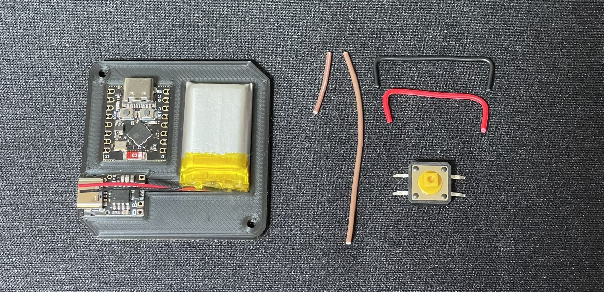
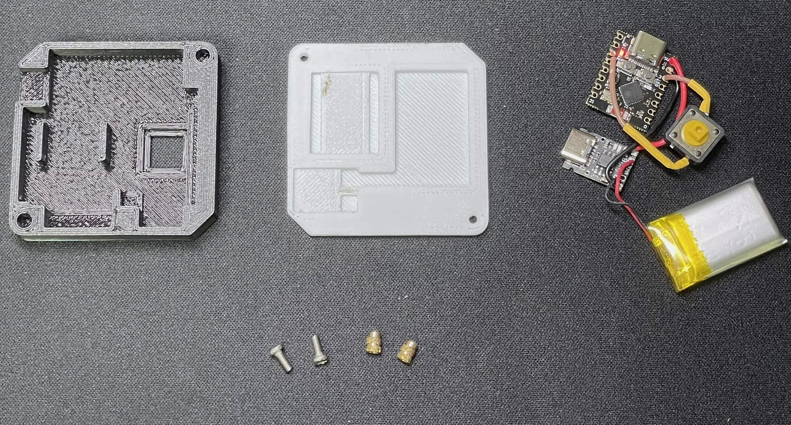
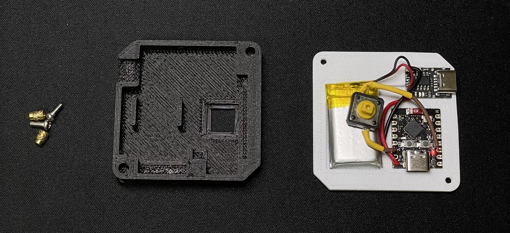
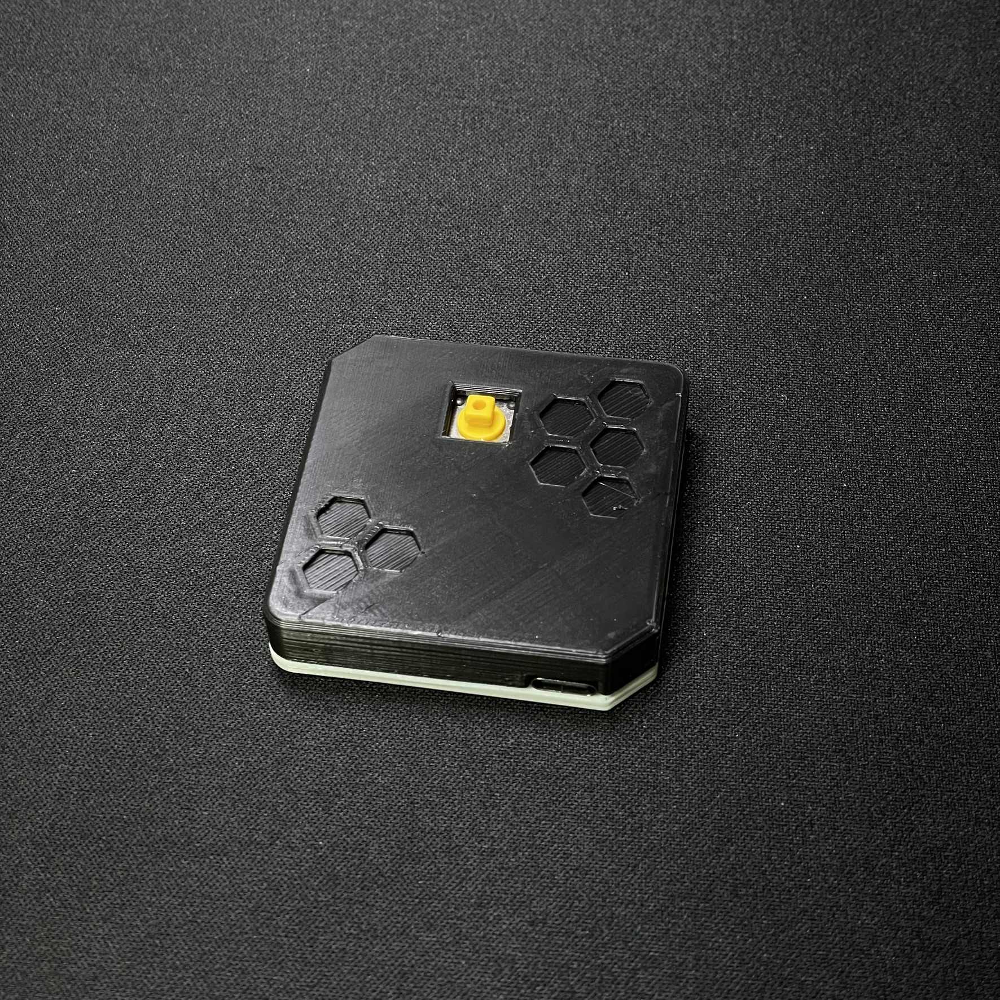

# OpenPhoneCameraTrigger

## Table of Contents
1. [Introduction](#introduction)
2. [Features](#features)
3. [How to Build Your Own OpenPhoneCameraTrigger](#how-to-build-your-own-openphonecameratrigger)
    1. [Required Components](#required-components)
    2. [Setting Up the Development Environment](#setting-up-the-development-environment)
    3. [Coding and Running](#coding-and-running)
    4. [Wiring and Connection Diagram](#wiring-and-connection-diagram)
    5. [3D Printing and Assembling the Enclosure](#3d-printing-and-assembling-the-enclosure)
4. [Version History](#version-history)
5. [Future improvement](#future-improvement)
6. [License](#license)

## Introduction
OpenPhoneCameraTrigger is a project designed to enable wireless control of camera trigger using an ESP32 based board. With this project, you can send volume control signals to trigger your phone camera's shutter remotely.

---

## Features
- Wireless phone camera trigger via Bluetooth.
- Compact and portable design.
- Easy to customize and extend functionality.
- Open-source code and 3D-printable enclosure.

---

## How to Build Your Own OpenPhoneCameraTrigger

### 1. Required Components
Here is a list of components you'll need to build this project:
- **ESP32-C3 Super Mini**  – [Link](https://a.aliexpress.com/_oErgR53)
- **Push button** – [Link](https://a.aliexpress.com/_olNm9Id)
- **3.7V** 300mAh 602030 LiPo **Battery** – [Link](https://a.aliexpress.com/_omasVAl)
- TP4057 **Battery Charger Board** – [Link](https://a.aliexpress.com/_onq9YhJ)
- Dupont cable or jumper wire

Other
- USB type-C cable to connect esp32 with pc
- PC or Laptop etc.. for coding and debugging

To build enclosure
- 3D-printed enclosure (stl files in [stl](https://github.com/junsulee119/OpenPhoneCameraTrigger/tree/main/stl))
- M2.5 OD4mm 5mm long Threaded insert * 2 [Link](https://a.aliexpress.com/_oCb7Maz)
- M2.5 6mm long bolt [Link](https://a.aliexpress.com/_olOMYyt)

---

### 2. Setting Up the Development Environment for ESP32
Follow these steps to set up your development environment:
1. Install Arduino IDE (Tested on version 2.3.3)
2. Add the ESP32 board package to the IDE (Tested on version 3.1.0-RC3)
    1. Go to **Tools > Board > Boards Manager** or **Ctrl+Shift+B**
    2. Serch **'esp32'**
    3. Install **'esp32 by Espressif Systems'**
3. Connect ESP32 to PC and select proper COM port
    1. Connect ESP32 Super Mini board to PC using USB Type-C cable (make sure that the USB cable supports data transmission)
    2. Go to **Tools > Port** and **select proper COM port** that ESP32 is connected at
4. Select ESP32 SuperMini board
    1. Go to **Tools > Board > esp32**
    2. Select **'Nologo ESP32C3 Super Mini'** (Selecting 'ESP32C3 Dev Module wont work!)

---

### 3. Coding and Running
1. Clone this repository or download the project files.
2. Open the `OpenPhoneCameraTrigger.ino` file in your IDE.
3. Compile and upload the code.
4. Monitor the Serial Output to verify functionality.

---

### 4. Wiring and Connection Diagram

>[!TIP]
> Print the enclosure first and then measure the required length for each wire. Otherwise, the enclosure might not fit

Below is the connection diagram for the project:

> [!CAUTION] 
> While handling batteries, always solder in a well-ventilated area, wear protective gear, and handle components with care to avoid burns or shorts. Use the correct temperature and soldering techniques, and never leave the iron unattended. When handling batteries, avoid short circuits, punctures, or heat exposure. Store and dispose of batteries properly, and always use the correct charger for safe operation

---

### 5. 3D Printing and Assembling the Enclosure
1. Print the provided `.stl` files using a 3D printer.
2. Gather additional assembly parts.

3. Insert each PCB part into the corresponding position.

4. Insert threaded inserts using soldering iron.

5. Assemble top and bottom parts. Be careful not to get any wire stuck between two parts.

6. Done!

---

## Code Version History
| Version | Release Date | Change Log                        |
|---------|--------------|-----------------------------------|
| 1.0.0   | 2024-12-02   | Initial release.                  |

---

## Future improvement
- 일정 시간 이상 input 이 없을 경우 idle 상태(deep sleep mode) 전환으로 배터리 사용시간 개선
- 전원 인가시 무조건 BLE advertizing가 아닌 버튼이 꾹 눌리면 페어링모드 (advertizing mode)로 진입하는 것으로 개선 (BLE advertizing은 배터리 소모 높음 → 배터리시간 개선, 전원 인가시 무조건 advertizing mode로 진입하는 것이 아닌 사용자 조작을 통해 사용자의 통제 범위 증가)
- 더 비싼 배터리 충전 / 방전 보드로 idle 상태에서 발생하는 battery drain 양 최소화 혹은 배터리와 배터리 충전 / 방전 보드 사이에 스위치 추가하여 수동으로 키고 끌 수 있게 개선
- 버튼이 눌린 시간 측정하여 버튼 꾹 누르면 영상촬영(각 휴대폰의 음량버튼 꾹 누름 설정) 기능 추가
- 적절한 저항과 납땜장비가 없어 충전보드의 충전전류가 배터리 용량에 비해 과도하게 높은 점 개선
- 충전 LED 정보 외부로 나타나게 개선
- 부품 단차 고려해서 모델 재설계

## License
The code for this project is licensed under the **GNU AGPL v3.0**. 

The 3D enclosure files are licensed under **CC BY-NC-SA 4.0**.

For more details, see the `LICENSE` file under each directory or visit [GNU AGPL v3.0 License](https://www.gnu.org/licenses/agpl-3.0.html), [CC BY-NC-SA 4.0](https://creativecommons.org/licenses/by-nc-sa/4.0/).
